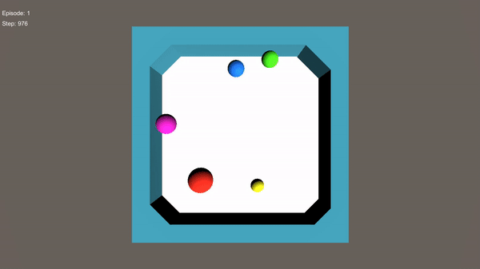

# Interaction Network

This repository is for implementing [Interaction Networks for Learning about Objects, Relations and Physics](https://arxiv.org/abs/1612.00222)

## Environment

There are 5 balls in the environment. They bounce when they collide with each other or collide with wall. 

1 episode is 1000 steps. At every episode, balls are on random position at random speed. 

Each ball has different mass and size. 

The state information of each ball is as follows. 

- Position x
- Position y
- Velocity x
- Velocity y
- Mass
- Size

Therefore, total state vector size is 30. (6 data X 5 balls)

